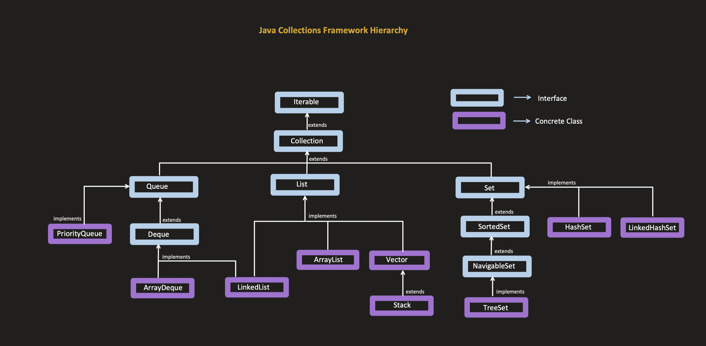

- collections => group of object
- framework => an architecture to manage these group of objects
	- need => to provide common interfaces for performing operations on group of objects

## Iterable interface

- mainly for traversing the collection
- Important methods :
	- *forEach(Consumer<> )* : takes a consumer and calls **accept** method for each element
	- *iterator()* : creates an instance of **Iterator** interface which in turn has below methods
		- *hasNext()* : checks if next element is present
		- *next()* : return current element and moves to next element
		- *forEachRemaining()* : traverse the remaining elements of the iterator
		- *remove()* : removes the current element of the iterator and moves to next element

## Collection interface 

- contains generic methods which have to be implemented by subclass (ArrayList, LinkedList, HashSet etc)

### Collection vs Collections

***Collection*** : 
- *Interface* that contains generic methods implemented by various collection classes like ArrayList, HashSet etc

***Collections*** :
- *Utility Class* that contains static methods for performing operations on a collection like sort, swaping, searching, reverse, copy etc

## Comparator vs Comparable

**Comparable** : 
	int compareTo(T t)

 - This interface is used to provide *natural ordering* for the objects of particular type
 - We can specify only *one* way of ordering the elements using this interface

**Comparator** :
	 int compare (T t1, T t2)
- This interface is used to compare 2 objects to decide the order
- This is a functional Interface
- we can define multiple comparators for a set of objects to compare with different properties.

## Queue

- Mostly follow properties of FIFO (first in first out)
- Methods in queue interface

### Priority Queue

- its a queue where polling happens on priority basis
- there are 2 types of priority queue -> max and min which are based on max and min priority heap
- Default is minHeap, maxHeap can be constructed using Comparator
- Time complexity : 
	- add : O(log n)
	- Peek : O(1)
	- poll : O(log n)
	- remove arbitrary element : O(n)

### Deque

- Deque stands for *DOUBLE ENDED QUEUE* . This special queue allows to perform operations at both ends of the queue.
- 
- 

- queue methods of deque will make it behave like a normal FIFO queue
	- add -> addLast()
	- poll -> pollFirst()
	- remove -> removeFirst()
	- peek() -> peekFirst()
- Time Complexity : 
	- Insert : O(1) Amortized
	- Deletion (ends) : O(1)
	- Search (ends) : O(1)
- ThreadSafe Versions of 
	- Priority Queue  => PriorityBlockingQueue
	- ArrayDeque   =>  ConcurrentLinkedDeque

## Map

